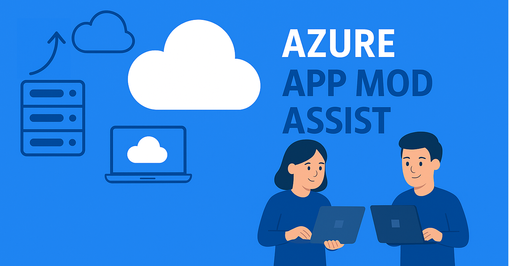

# 💼 Expense Management System

A modern, cloud-native expense management application built with ASP.NET Core 8 and deployed on Azure. Features AI-powered chat assistance using Azure OpenAI.



## ✨ Features

- 📊 **Dashboard Overview** - View expense summaries and statistics
- 💰 **Expense Management** - Create, submit, approve, and reject expenses
- 👥 **User Management** - Manage employees and managers
- 💬 **AI Chat Assistant** - Natural language interaction with your expense data
- 🔒 **Secure** - Azure AD-only authentication with Managed Identity
- 📱 **Modern UI** - Clean, responsive interface
- 🔄 **REST APIs** - Full API support with Swagger documentation

## 🏗️ Architecture

The application uses modern Azure services with secure, best-practice configurations:

- **App Service** (Linux, S1 SKU) - Hosts the .NET 8 application
- **Azure SQL Database** - Stores expense data with Entra ID authentication
- **User-Assigned Managed Identity** - Secure authentication without passwords
- **Azure OpenAI** (Optional) - GPT-4o model for chat functionality
- **Azure AI Search** (Optional) - RAG capabilities for enhanced chat

See [ARCHITECTURE.md](ARCHITECTURE.md) for detailed architecture diagrams and explanations.

## 🚀 Quick Start

### Prerequisites

- Azure CLI installed and logged in (`az login`)
- Azure subscription with appropriate permissions
- Bash shell (Linux, macOS, or WSL on Windows)
- Python 3 with `pyodbc` and `azure-identity` packages
- .NET 8 SDK (for local development)

### Option 1: Basic Deployment (No AI)

Deploy the core application with expense management features:

```bash
# Clone the repository
git clone https://github.com/DCSEORG/AMBFORKWED1549.git
cd AMBFORKWED1549

# Make scripts executable
chmod +x deploy.sh

# Run deployment
./deploy.sh
```

**Resources Created:**
- Resource Group
- App Service (with Managed Identity)
- Azure SQL Database
- All necessary configurations

**Deployment Time:** ~5-10 minutes

### Option 2: Full Deployment (With AI Chat)

Deploy everything including AI-powered chat functionality:

```bash
# Clone the repository
git clone https://github.com/DCSEORG/AMBFORKWED1549.git
cd AMBFORKWED1549

# Make scripts executable
chmod +x deploy-with-chat.sh

# Run deployment
./deploy-with-chat.sh
```

**Additional Resources Created:**
- Azure OpenAI (GPT-4o in Sweden Central)
- Azure AI Search
- GenAI configurations

**Deployment Time:** ~10-15 minutes

## 📖 Post-Deployment

After deployment completes, you'll see output similar to:

```
==========================================
Deployment Complete!
==========================================

Important Information:
  App Service URL: https://app-expensemgmt-abc123.azurewebsites.net/Index
  (Note: Navigate to /Index, not just the root URL)
```

### Accessing the Application

- **Dashboard**: `https://your-app.azurewebsites.net/Index`
- **Expenses**: `https://your-app.azurewebsites.net/Expenses`
- **Users**: `https://your-app.azurewebsites.net/Users`
- **Chat**: `https://your-app.azurewebsites.net/Chat`
- **API Docs**: `https://your-app.azurewebsites.net/swagger`

## 🧪 Local Development

To run the application locally:

1. **Clone and navigate to the project:**
   ```bash
   cd src/ExpenseManagement
   ```

2. **Update appsettings.json** with your Azure SQL connection:
   ```json
   {
     "ConnectionStrings": {
       "DefaultConnection": "Server=tcp:your-server.database.windows.net;Database=Northwind;Authentication=Active Directory Default;Encrypt=True;"
     }
   }
   ```

3. **Login to Azure:**
   ```bash
   az login
   ```

4. **Run the application:**
   ```bash
   dotnet run
   ```

5. **Access at:** `https://localhost:5001/Index`

## 🔐 Security Features

✅ **Azure AD-Only Authentication** - No SQL passwords
✅ **Managed Identity** - Secure service-to-service authentication
✅ **HTTPS Enforced** - All traffic encrypted
✅ **Stored Procedures Only** - No direct table access from app
✅ **TLS 1.2+** - Modern encryption standards
✅ **Role-Based Access** - Granular permissions

## 💡 Using the AI Chat Assistant

The AI chat assistant (when GenAI is deployed) can:

- **List expenses:** "Show me all expenses from last week"
- **Create expenses:** "Create a £50 travel expense for today"
- **Search users:** "List all managers"
- **Get categories:** "What expense categories are available?"
- **Filter data:** "Show me approved expenses"

The assistant uses function calling to interact with real database data.

## 📊 Cost Estimate

### Basic Deployment
- App Service (S1): ~£56/month
- Azure SQL (Basic): ~£4/month
- **Total: ~£60/month**

### With GenAI
- Above plus:
- Azure OpenAI (S0): Pay per token (~£5-20/month typical usage)
- Azure AI Search (Basic): ~£57/month
- **Total: ~£117/month + token usage**

## 🛠️ Technology Stack

- **Backend**: ASP.NET Core 8 (LTS)
- **Frontend**: Razor Pages with modern CSS
- **Database**: Azure SQL Database
- **AI**: Azure OpenAI (GPT-4o)
- **Search**: Azure AI Search
- **Identity**: Azure AD / Entra ID
- **Infrastructure**: Bicep templates

## 📝 API Documentation

The application includes full Swagger documentation for all REST APIs:

- **Expenses API** - CRUD operations for expenses
- **Users API** - User management
- **Lookups API** - Categories, statuses, roles
- **Chat API** - AI assistant interaction

Access at: `https://your-app.azurewebsites.net/swagger`

## 🤝 Contributing

This project is designed as a demonstration of modern Azure application patterns. Feel free to fork and modify for your needs.

## 📄 License

See [LICENSE](LICENSE) file for details.

## 🔗 References

- [Azure App Service Documentation](https://learn.microsoft.com/azure/app-service/)
- [Azure SQL Database Best Practices](https://learn.microsoft.com/azure/azure-sql/)
- [Azure OpenAI Service](https://learn.microsoft.com/azure/ai-services/openai/)
- [Managed Identity Documentation](https://learn.microsoft.com/azure/active-directory/managed-identities-azure-resources/)

## 🐛 Troubleshooting

### Database Connection Issues

If you see database connection errors:

1. **Check Managed Identity**: Ensure the managed identity has proper SQL permissions
2. **Verify Firewall**: Confirm your IP is added to SQL firewall rules
3. **Check Connection String**: Verify the format uses "Authentication=Active Directory Managed Identity"

### AI Chat Not Working

If deployed with GenAI but chat shows "GenAI Services Not Deployed":

1. **Verify Deployment**: Check that `deploy-with-chat.sh` was used
2. **Check App Settings**: Ensure OpenAI__Endpoint and OpenAI__DeploymentName are set
3. **Managed Identity**: Confirm identity has "Cognitive Services OpenAI User" role

### Local Development Issues

If authentication fails locally:

1. Run `az login` to authenticate
2. Ensure you're using "Authentication=Active Directory Default" in connection string
3. Verify you have access to the Azure SQL Database

## 📞 Support

For issues specific to this implementation, please open an issue in this repository.

For Azure service issues, consult Azure documentation or Azure support.

---

**Built with ❤️ using Azure best practices**
